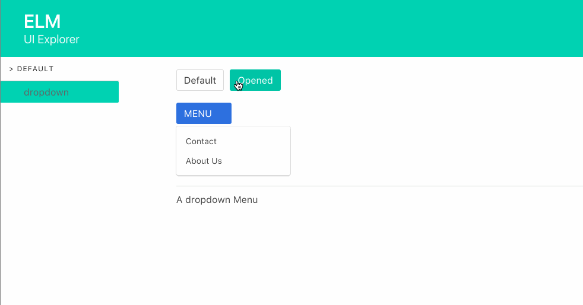

## Simple Example


The simplest integration of a view in the Elm UI Explorer. The example shows a dropdown menu with two states (Default & Opened)


<center>

</center>


### How to run it
- run ```elm-reactor``` to launch the dev server
- Go to http://localhost:8000/public/index.html to run the project
- Go to http://localhost:8000/public/explorer.html to run the UI Explorer
