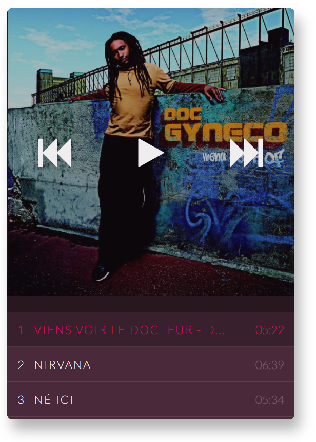

## Music Player

This is a simple Music Player in ELM.
- It uses ports with the HTML5 Audio Api.
- SoundTracks are Mocked from Spotify API.





### Structure

- public : Contains static assets such as html and css
- src : Source of the Music Player App
- storybook : Contains the App of the UI Explorer
- elm-package : Describes ELM packages dependencies
- package.json : Describes Node packages dependencies


### How to run it
- run ```npm i``` to install node packages
- run ```npm start``` to run the Music Player
- run ```npm storybook``` to run the UI Explorer


### Notes

- This project was bootstrapped with [Create Elm App](https://github.com/halfzebra/create-elm-app).
