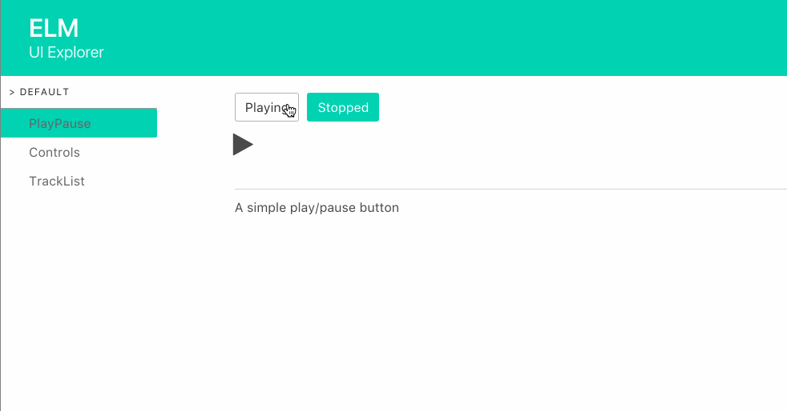

## Music Player

This is a simple music player in Elm.
- It uses ports with the HTML5 Audio API.
- Sound tracks are mocked from Spotify API.

<center>

</center>

The UI Explorer showcases how each view works in isolation.

<center>

</center>

### Structure

- public : Contains static assets such as html and css
- src : Source of the music player application
- explorer : Contains the UI Explorer
- elm-package : Describes Elm packages dependencies
- package.json : Describes Node packages dependencies


### How to run
#### The App
- run ```npm i``` to install node packages
- run ```npm start``` to run the music player

#### The UI Explorer
- run ```cd explorer```
- run ```npm i``` to install node packages
- run ```npm start``` to run the UI Explorer


### Notes

- This project was bootstrapped with [Create Elm App](https://github.com/halfzebra/create-elm-app).
